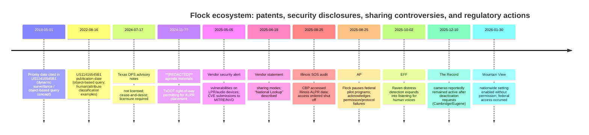

# Flock Safety ALPR in **[REDACTED]**, Texas: council-ready, evidence-led talking points on hackability, integrations, federal access, and feature creep

## Executive summary

**[REDACTED]** is being asked to expand a technology that is no longer “just licence plates”: the vendor markets an ecosystem that ties LPR + video + audio + AI natural-language search + cross‑jurisdiction sharing + integrations via APIs into a single platform. 

Multiple **documented incidents** show how “sharing controls” and “who can access what” can fail in practice—most notably: **Mountain View’s** official statement that a “nationwide” search setting was enabled by the vendor without the police department’s knowledge/permission, enabling federal access to a camera. 

On **hackability**, you do not need to speculate. There are **public CVEs in the National Institute of Standards and Technology National Vulnerability Database** describing vulnerabilities in Flock hardware/software (including administrative endpoints without authentication on LPR devices and multiple device hardening failures), plus a vendor security advisory acknowledging submissions to MITRE/NVD. 

The most persuasive path at a council meeting is not “ban it/no ban,” but: pause expansion until **[REDACTED]** has written, enforceable guardrails: retention caps, explicit sharing limits (including “National Lookup”), prohibition on audio/voice detection, independent security assessment, logging and public reporting, and iron‑clad controls on integrations and vendor configuration changes. 

## What the system is and what it is becoming

Flock marketing and policy documents describe a platform approach (“the camera is just the beginning”) that expands beyond plate reads into “nationwide network” participation, AI-powered search, and additional sensors/products. 

“FreeForm” is marketed as **AI-powered natural-language search and alerts** “across video and LPR,” meaning the direction of travel is broader content search rather than a narrow “plate-only tool.” 

The vendor also markets **gunshot/audio detection** that links sounds to LPR and video “through FlockOS,” reinforcing that the ecosystem is designed for **cross‑modal correlation**. 

## Hackability and device-level risk in plain English

Even if a system is “mostly cloud,” the street-side hardware is still a computer with radios and ports. Public disclosures show real, specific weaknesses in Flock devices—some requiring proximity/physical access, but that is relevant because the devices sit in public right‑of‑way. 

One example (LPR devices): **CVE‑2025‑59403** describes an Android application used on certain Flock LPR/edge devices exposing **administrative endpoints on port 8080 without authentication**, including endpoints to reboot the device and enable ADB debugging—conditions that can enable disruption and potentially shell access for someone on the same network segment. 

Physical hardening matters too: **CVE‑2025‑47822** describes Flock LPR devices with firmware through 2.2 having an **on‑chip debug interface with improper access control**, i.e., a form of physical attack surface that can become serious if someone can access/handle a unit. 

Independent security research has also claimed practical exploitation paths (e.g., activating a device hotspot and using default hotspot credentials), which is precisely why councils should demand an **independent security assessment and patch-status evidence**, not just assurances. 

Flock has published a security advisory acknowledging it was alerted to “limited, localized” vulnerabilities on LPR and gunshot-detection devices and that it submitted issues to MITRE/NVD—useful here because it confirms this is a **known vulnerability-management topic**, not hypothetical. 

## Data flows and access: retention, sharing, “National Lookup,” and federal reach

Flock’s official materials state a **standard retention of 30 days**, but also that retention can be changed by customer law/policy, and its Evidence Policy states the 30‑day default applies “unless otherwise specified” in the customer agreement—meaning the contract/policy is the real control surface, not marketing bullet points. 

Flock also states it may offer **extended retention up to one year** if the local agency obtains approval from an elected official/governing body—important because council votes can become the lever that normalises longer retention over time. 

On sharing, Flock describes multiple sharing modes and an opt‑in “National Lookup” network that allows searching for **one specific full plate** across other opted‑in agencies’ cameras—this is the mechanism councils should explicitly accept or reject, because it functionally determines cross‑border visibility. 

Federal access is not conjecture. The **Illinois Secretary of State** reported an audit finding that **U.S. Customs and Border Protection accessed Illinois ALPR data and that this violated state law; the Secretary ordered access shut off. 

Following Illinois scrutiny, **Associated Press** reported that Flock paused pilot programs with federal agencies and acknowledged failures around permissions/protocols for federal users—demonstrating that “who can access this, and how” has been unstable enough to trigger public-policy rupture. 

Separately, **Mountain View’s** official statement alleges a “nationwide” search setting was enabled by the vendor without local permission/knowledge, enabling federal access to a camera—an especially potent council talking point because it goes directly to the “we control our settings” assurance. 

## Legal and regulatory incidents relevant to Texas councils

**[REDACTED]**-specific documentation shows the City has been working through the Texas Department of Transportation right‑of‑way permitting framework for ALPR placement, and that the cameras were approved for purchase with seized funds, with installation along state-funded roadways including **[REDACTED]**. 

On Texas compliance risk, minutes from a **Texas Department of Public Safety** advisory committee meeting state that after investigation Flock was not licensed, received a cease‑and‑desist, and needed to obtain licensure to continue operations. 

Outside Texas but directly relevant for vendor due diligence, **GovTech** reported that a Wake County judge ordered Flock to stop installing ALPR cameras statewide in North Carolina over licensing issues. 

On “misrepresentation / controls not behaving as described,” The Record reported that officials in Cambridge and Eugene found cameras remained active after deactivation requests, and Cambridge terminated its contract after the company installed new cameras after the council ordered deactivation—useful as a cautionary example about operational control and vendor compliance. 

## Council-ready talking points and questions for **[REDACTED]**

- **“Those who would give up essential Liberty, to purchase a little temporary Safety, deserve neither Liberty nor Safety.”** (Pennsylvania Assembly reply, 1755). Use it as the principle: safety tools must come with hard limits, not open-ended expansion. 

- **[REDACTED]**’s own agenda documents show the City is permitting ALPR placement on TxDOT right‑of‑way and discussing installation on major corridors; the question is not “do we like policing,” but “what binding guardrails exist before we scale.” Question: Where is the written **[REDACTED]** ALPR policy that council has approved before adding more cameras? 

- Retention is a policy choice, not a guarantee. Flock says 30 days is “standard,” but also says retention can be increased/decreased and that contracts can override defaults. Question: What retention is written into **[REDACTED]**’s contract and policy, and will council ban any extension without a recorded vote? 

- Flock states it will offer retention up to one year if the agency gets governing-body approval; that means “just one more year” can become the new normal. Question: Will **[REDACTED]** adopt an ordinance capping retention (e.g., 30 days) and prohibiting longer retention entirely? 

- Flock describes “National Lookup” as opt‑in and designed for cross‑state searching of a full plate number. Question: Is **[REDACTED]** opted into National Lookup or any statewide/nationwide sharing mode, and will council require specific approval for each sharing setting? 

- Federal access has occurred elsewhere: Illinois’ Secretary of State said CBP accessed Illinois ALPR data in violation of state law and ordered access shut off. Question: What prevents federal agencies from obtaining access to **[REDACTED]** plate data—either directly or via other agencies searching **[REDACTED]**’s cameras? 

- Mountain View’s official statement says a “nationwide” search setting was enabled by the vendor without the police department’s permission/knowledge, enabling federal access to a camera. Question: Can **[REDACTED]** obtain a written, technically enforceable guarantee that the vendor cannot enable new sharing settings without **[REDACTED]**’s explicit authorisation—and how would we detect it if they did? 

- Hackability is documented: CVE‑2025‑59403 describes LPR/edge devices exposing administrative endpoints without authentication, including the ability to enable ADB debugging. Question: Has **[REDACTED]** required an independent security test and written patch-status attestation for every deployed camera model/firmware? 

- Physical tampering risk is also documented: CVE‑2025‑47822 describes an improperly controlled on-chip debug interface on LPR devices (firmware through 2.2). Question: What is **[REDACTED]**’s plan for tamper detection, rapid replacement, and ensuring compromised devices cannot be used to pivot into City or police networks? 

- Flock has itself published a security alert acknowledging vulnerabilities and CVE submissions. **Question:** Will council require a standing, public vulnerability and patching report (what was found, when patched, how verified) as a condition of renewal/expansion? 

- Feature creep is built into the product roadmap: FreeForm is marketed as AI-powered natural-language search “across video and LPR.” Question: Will **[REDACTED]** prohibit natural‑language “describe a person/vehicle” searches unless there is a named case number and written supervisory approval? 

- The ACLU has warned that Flock’s expansion goes beyond plates into broader surveillance capabilities (including moves toward video capture/clips and AI search). Question: Will **[REDACTED]** prohibit any upgrade that adds “video clips,” live feeds, or broader content search from the ALPR network without a full council vote and updated policy? 

- Audio is a clear expansion vector: EFF reports that Raven microphones are being marketed as adding “distress detection” that listens for human voices (e.g., screaming). Question: Will **[REDACTED]** ban microphones/voice analytics outright in any public-right‑of‑way deployment, and state that no future “audio add‑on” will be approved? 

- Integrations create hidden data pathways: Flock’s API terms define “Data” broadly to include images, video, audio, time, and location, and third‑party platforms (e.g., Genetec) document ingesting Flock ALPR data via integrations. Question: Will **[REDACTED]** require a public list of every integration/export recipient (RTCC software, analytics platforms, contractors) and prohibit any integration until council approval? 

- On the “Palantir” question: I found no primary/official document showing a direct, contractual Flock→Palantir integration in **[REDACTED]**. The governance issue remains: if data can be exported via APIs/integrations, you must force disclosure of all third‑party recipients. Question: Does **[REDACTED]** (or its regional partners) use any data‑fusion platform (including Palantir), and will staff certify in writing whether any ALPR data is exported to such systems? 

- Texas licensing/compliance has been a public issue: Texas DPS meeting minutes note a cease‑and‑desist and that Flock was not licensed until it pursued licensure. Question: Will **[REDACTED]** require written proof of current Texas licensing/compliance and an indemnity clause covering evidentiary/legal challenges if compliance lapses again? 

- North Carolina shows how licensing disputes can halt deployments and disrupt contracts. Question: What is **[REDACTED]**’s contractual “off‑ramp” if regulatory action, security findings, or vendor misconfiguration makes the system unusable or legally risky? 

- Costs don’t just mean purchase price: Flock describes an annual subscription “turnkey” model and separately publishes reinstall/relocation fee schedules. Question: What is the full 5‑year total cost to **[REDACTED]** (subscriptions, installs, relocations, replacements), and what happens to data/access if **[REDACTED]** terminates? 

### Technical “receipts” you can cite if someone says “these can’t be hacked”

- CVE‑2025‑59403 (unauthenticated admin endpoints on port 8080; includes /adb/enable) 
- CVE‑2025‑47822 (LPR on‑chip debug interface with improper access control) 
- Security researcher writeup claiming shell access over Wi‑Fi / hotspot defaults on LPR devices (use as “why independent testing is needed,” not as gospel) 
- Flock’s own security alert acknowledging vulnerability submissions to MITRE/NVD 

## Angles to spark community concern

Privacy and liberty are the “why,” but these are the angles that reliably open discussion in mixed crowds:

- **Mass tracking capacity:** The platform is designed for cross‑jurisdiction search/sharing and “national network” participation, which transforms local cameras into part of a wider visibility system. 
- **Federal overreach risk:** Illinois’ audit finding (CBP access) and Mountain View’s configuration failure claim are tangible examples residents can grasp. 
- **Mission creep (audio/video/AI searches):** FreeForm’s AI search across LPR + video and reported expansion into voice “distress detection” show why “it’s only plates” is a fragile promise. 
- **Hack and abuse risk:** Public CVEs about weak admin controls and debug access show why audits and segmentation matter even if “no breach has happened here.” 
- **Vendor control vs local control:** Mountain View’s statement about vendor‑enabled settings and The Record’s reporting about cameras remaining active after deactivation requests both undermine “we can just switch it off whenever.” 
- **Cost and lock‑in:** Subscription + reinstall fees + ecosystem add‑ons (video/audio/AI) can turn an initial pilot into a long-term budget line with limited exit options. 

## One-page handout: risks vs mitigations for **[REDACTED]**

| Risk | Evidence | Local ask |
|---|---|---|
| Vendor-enabled “nationwide” access beyond local intent | Mountain View says a “nationwide” setting was enabled by the vendor without local permission/knowledge, enabling federal access to a camera. | Require contract clause: **no configuration changes** without written approval; monthly independent configuration audit; immediate disable capability verified by City IT. |
| Federal access through pilots/partner agencies | Illinois Secretary of State audit finding of CBP access; AP: federal pilots paused and permissions/protocols were unclear. | Ban participation in federal pilots; require **“no federal access”** clause; require reporting of any federal-origin query attempts. |
| Retention quietly expands | Flock: retention is configurable; Evidence Policy: standard 30 days unless contract says otherwise; extended retention up to 1 year with governing-body approval. | Set retention cap by ordinance (e.g., 30 days), forbid extensions; require public vote for any change; require deletion verification. |
| Cross-jurisdiction sharing becomes default | Flock explains National Lookup opt‑in and national network sharing. | Default to **no sharing** beyond named local partners; require a council vote to opt into National Lookup; publish list of partner agencies. |
| Hackability / remote or local compromise | CVE‑2025‑59403 (unauth admin endpoints incl. /adb/enable); CVE‑2025‑47822 (debug interface). | Independent penetration test; network segmentation; tamper alarms; patch SLAs; incident response plan; public reporting triggers. |
| Feature creep into video dragnet search | FreeForm is marketed as AI search across video + LPR; ACLU warns of expansion into broader surveillance/video capabilities. | Prohibit ALPR-linked video capture/clips/live feed without new council approval; restrict searches to case numbers + supervisor sign-off. |
| Feature creep into audio/voice detection | EFF reports Raven’s “distress detection” adds listening for human voices. | Explicitly ban microphones/voice analytics in public right‑of‑way deployments; forbid procurement of audio sensors without separate ordinance. |
| Hidden third-party integrations and data exports | API terms define “Data” to include images/video/audio/time/location; Genetec doc shows ingesting Flock data via integration. | Require a public integration register (who receives/exported data); prohibit any integration until council approval and privacy impact assessment. |

## Discussion openers for non-technical councillors

- “If we install **more** cameras, what written limits stop this from turning into a permanent tracking network—especially when the vendor markets nationwide sharing?” 
- “What is our **off‑switch**—and how do we verify it works—given other cities’ reports of settings being enabled or cameras staying active after they were told to be off?” 
- “If a camera is hacked or misconfigured, who is accountable, and can a compromise spread to other City systems?” 
- “What is the five‑year total cost, including maintenance/relocation/replacement—and what do we lose if we terminate?” 
- “Can staff show, in writing, whether **[REDACTED]** has opted into ‘National Lookup’ or any nationwide sharing—and if so, why?” 

## Timeline of key developments and incidents

Sources for date points above include the patent record, Texas DPS minutes, **[REDACTED]** agenda materials, vendor security/disclosure pages, Illinois audit press release, AP reporting, EFF reporting, The Record reporting, and Mountain View’s city statement. 