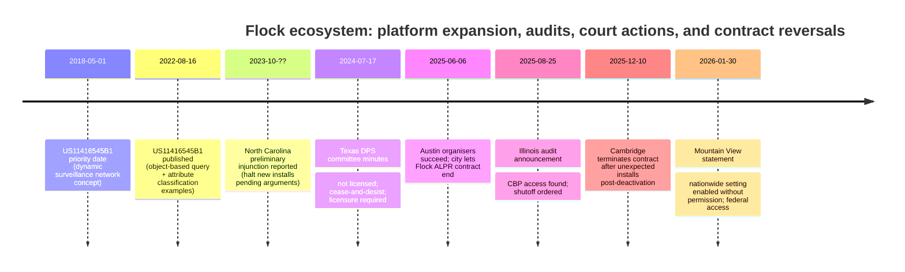

# ALPR risks and governance questions for City Council

## Executive summary

This packet focuses on what you can **prove in public** from primary and reputable sources: documented vulnerabilities (CVEs), documented access failures and misconfigurations, and the vendor’s own roadmap language (“platform,” AI search across video/LPR, and audio detection). 

The practical council issue is not “Is the camera good or bad?” It is whether **[REDACTED]** is authorising (or expanding) an ecosystem that can become a permanent surveillance substrate through (a) network sharing, (b) integrations/APIs, and (c) feature creep from plates → video search → audio/voice analytics. 

Three incidents are particularly persuasive because they are either **official government statements** or **audits**: (1) an Illinois audit finding that U.S. Customs and Border Protection accessed ALPR data in violation of state law, (2) a city statement that a “nationwide” search setting was enabled by the vendor without local permission/knowledge, and (3) a state regulatory meeting record saying the vendor operated without required licensing and received a cease-and-desist. 

On “dystopian future” framing: you can stay factual by pointing out that the vendor markets **AI-powered search “across video and LPR”** and audio products that explicitly link sounds with LPR/video; even if “today’s configuration” is narrow, the **architecture and commercial incentives** are for expansion. 

## Three blunt opening lines for councillors

- “If we can’t put the contract, retention, sharing settings, and audit rules on one page in plain English, we are being asked to approve surveillance we don’t actually control.”
- “This isn’t just cameras; it’s a platform designed to expand—video search, audio detection, and cross‑agency lookups—unless we lock it down now.”
- “Before we add even one more unit, show us how we turn it off, prove it’s off, and prove our settings can’t be changed without our knowledge.”

## Council packet

- **“Those who would give up essential Liberty, to purchase a little temporary Safety, deserve neither Liberty nor Safety.” — Benjamin Franklin** 
 Use as the principle: any safety system must have hard limits, transparency, and a real off‑ramp—otherwise the ‘temporary’ measure becomes permanent infrastructure. 

- **This is marketed as a platform, not a device (“the camera is just the beginning”).** 
 When a vendor sells an ecosystem (hardware + software + network access), “just a few more cameras” is how scope expands quietly over time. **Ask:** What is the written policy that prevents platform expansion into broader surveillance? 

- **The patent vision is a “dynamic surveillance network” that ingests unrelated video sources and makes them searchable by “objects” and attributes.** 
 That’s the blueprint for a future where disparate cameras become one searchable database, including classification of humans and their attributes (example given: “human… male… wearing a jacket… height/weight”). Ask: Will **[REDACTED]** prohibit any move toward person‑attribute searching or cross‑camera “tracking” features? 

- **FreeForm explicitly sells AI-powered natural-language searching “across video and LPR,” including searching for people by description.** 
 Even without naming someone, “type what you know” people-search is a major surveillance jump: it broadens from “plate match” to “find a person who looks like X.” Ask: Will **[REDACTED]** ban FreeForm-style person description searches unless it’s tied to a case number and supervisor approval? 

- **Audio feature creep is real: Raven microphones are being expanded to listen for “human voices in distress.”** 
 Once microphones are mounted above streets, “critical sounds” can become always‑listening voice analytics. Ask: Will **[REDACTED]** adopt a hard ban on microphones/voice distress detection in public right‑of‑way? 

- **Retention is not a promise; it is a contract term—and the vendor’s evidence policy says the 30‑day standard can be overridden by the customer agreement.** 
 This makes “30 days” a starting point, not a guarantee. Ask: What is **[REDACTED]**’s exact retention in the signed agreement, and will council cap it by ordinance (no exceptions)? 

- **Network sharing is an explicit product feature: “National Lookup” enables searching a full plate across cameras in other opted‑in agencies.** 
 Even if limited to “one complete plate,” the effect is still cross‑jurisdiction search capability. Ask: Is **[REDACTED]** opted into National Lookup or any statewide/nationwide lookup mode, and will council require a recorded vote before any opt‑in? 

- **Federal access is documented: the Illinois Secretary of State announced an audit finding that CBP gained access to Illinois ALPR data in violation of state law.** 
 This shows that “federal access won’t happen” is not a safe assumption; governance can fail or be bypassed. Ask: What blocks federal agencies from accessing **[REDACTED]**-collected data directly or indirectly via partners? 

- **A city government statement says a “nationwide” search setting was turned on by the vendor without local permission/knowledge, enabling federal access to a camera.** 
 This is the strongest rebuttal to “we control our settings”: at least one city says settings were enabled without consent. Ask: Will **[REDACTED]** require independent verification and automatic alerts for any setting changes (and contractual penalties if settings change without approval)? 

- **Texas licensing/compliance risk is on the record: Texas DPS advisory committee minutes state the vendor was not licensed, received a cease and desist, and needed licensure to continue operating.** 
 Even if **[REDACTED]**’s deployment differs from private installs, this is a due‑diligence and evidentiary-risk issue for any council approving expansion. Ask: Will staff publish written proof of current Texas licensing status, insurance compliance, and a termination clause if compliance lapses? 

- **A judge in North Carolina ordered the company to stop installing ALPR cameras statewide (preliminary injunction) over licensing issues.** 
 This demonstrates how regulatory fragility can disrupt deployments and contracts and can create operational and legal uncertainty. Ask: What is **[REDACTED]**’s off‑ramp if a court/regulator action halts work or undermines evidentiary reliability? 

- **Hackability is documented in NVD: an Android app on certain devices exposed administrative endpoints on port 8080 without authentication, including an endpoint to enable ADB.** 
 These are roadside computers. Vulnerabilities mean disruption risk at minimum—and potentially broader compromise depending on network design. Ask: Has **[REDACTED]** required a third‑party security assessment and a public patch-status attestation for every model/firmware in use? 

- **Integrations/APIs make “where the data goes” a policy question: Flock’s API terms define “Data” to include images, video, audio, time, location, and derivatives.** 
 If data can be sent/received through integrations, “who gets access” becomes a moving target unless council requires an integrations register and approval process. Ask: Will **[REDACTED]** require a public list of every integration/export recipient and ban any integration until council approval? (I did not find primary evidence of a direct Palantir integration; treat it as an “export destination” question and demand disclosure.) 

## Handout table

| Risk | Evidence | Local ask |
|---|---|---|
| Vendor or configuration changes can enable broader lookups without city awareness | A city statement alleges a “nationwide” setting was enabled by the vendor without local permission/knowledge. | Contract: no setting changes without written authorisation; automated alerts; monthly configuration audit; penalties for unauthorised changes. |
| Federal access (direct or indirect) | Illinois audit announcement: CBP gained access to ALPR data in violation of state law. | Ban federal access; require reporting of any federal-origin queries; require partner-agency restrictions and audit review. |
| Mission creep to AI people-search | FreeForm markets AI search “across video and LPR,” including people-by-description examples. | Prohibit people searches by description without case number + supervisor approval; ban any expansion into identity/face analytics. |
| Mission creep to microphones / voice analytics | EFF documents Raven expansion to listen for “human voices in distress.” | Ordinance: no microphones/voice analytics in public ROW; separate vote required for any audio sensors. |
| Hackability / disruption / compromise | NVD CVE describes unauthenticated admin endpoints on devices’ Android app (port 8080), including /adb/enable. | Independent penetration test; network segmentation; rapid patch SLAs; public vulnerability reporting triggers. |
| Legal/compliance fragility | Texas DPS committee minutes: vendor not licensed; cease and desist; licensure required. | Require written proof of licensing/insurance; indemnity for evidentiary challenges; immediate suspension clause for compliance lapses. |

## Technical references you can cite if someone says “these can’t be hacked”

These are suitable to print as an appendix. They are not “how‑to” instructions—just evidence that vulnerabilities exist.

- CVE‑2025‑59403 (unauthenticated admin endpoints on port 8080; includes /adb/enable). 
- CVE‑2025‑59409 (development Wi‑Fi credentials stored in cleartext in production firmware). 
- CVE‑2025‑59407 (bundled Java keystore + hardcoded password containing a private key). 
- GainSec write‑up referenced by NVD as a source for the Wi‑Fi credentials CVE (use as supporting technical context). 

## Documented examples where the vendor’s actions conflicted with local expectations or controls

- **Settings enabled without consent:** City statement alleging a “nationwide” search setting was enabled by the vendor without local permission/knowledge, enabling federal access to a camera. 
- **Unexpected installations after shutdown:** A city statement that after deactivation/removal, concerns were “substantiated” when the vendor notified the city that two cameras had been installed by its technicians without the city’s awareness, following a work order that should have been cancelled when the account was deactivated. 
- **Cameras remaining active / reappearing after deactivation:** The Record reports issues where cameras remained active after cities asked them turned off and describes a situation in which Evanston officials sought shutdown and cameras later reappeared, prompting physical measures to ensure they were not collecting data. 

## Timeline grounding

Key dated events used in the timeline below include: patent publication (Aug 2022), North Carolina injunction reporting (Nov 2023), Texas DPS committee minutes (Jul 2024), Austin contract cancellation (Jun 2025), Illinois audit announcement (Aug 2025), Cambridge termination statement (Dec 2025), and the Mountain View city statement (Jan 2026). 



## Key source links

You can hand these to councillors/staff and say: “These are the documents my points come from.”

```text
Ben Franklin quote (Franklin Papers): https://franklinpapers.org/framedVolumes.jsp?page=238a&vol=6
Flock FreeForm product page: https://www.flocksafety.com/products/flock-freeform
Flock Privacy & Ethics (retention and claims): https://www.flocksafety.com/privacy-ethics
Flock Evidence Policy (30 days unless contract specifies): https://www.flocksafety.com/legal/flock-evidence-policy
Flock statement on National Lookup and sharing: https://www.flocksafety.com/blog/statement-network-sharing-use-cases-federal-cooperation
Illinois SOS audit announcement (CBP access): https://www.ilsos.gov/news/2025/august-25-2025-giannoulias-audit-finds-license-plate-reader-company-in-violation-of-state-law.html
Mountain View city statement: https://www.mountainview.gov/Home/Components/News/News/1203/284
Texas DPS committee minutes (cease and desist/licensing): https://www.dps.texas.gov/sites/default/files/documents/rsd/psb/advcommnotes/advcommnotes20240717.pdf
NVD CVE-2025-59403: https://nvd.nist.gov/vuln/detail/CVE-2025-59403
NVD CVE-2025-59409: https://nvd.nist.gov/vuln/detail/CVE-2025-59409
NVD CVE-2025-59407: https://nvd.nist.gov/vuln/detail/CVE-2025-59407
EFF on Raven “human voices” feature creep: https://www.eff.org/deeplinks/2025/10/flocks-gunshot-detection-microphones-will-start-listening-human-voices
Cambridge termination statement: https://www.cambridgema.gov/news/2025/12/statementontheflocksafetyalprcontracttermination
```